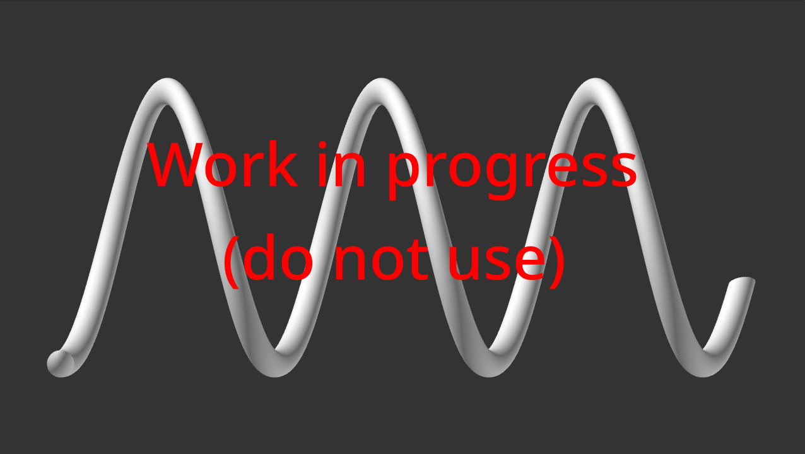
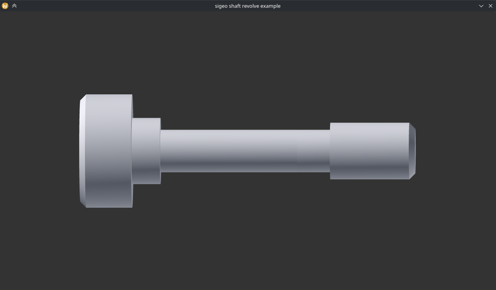

# sigeo

Computational geometry



(work-in-progress, do not use)


## Example

[extrusion, shown on window](examples/extrusion.nim)

```nim
proc spiralF(t: float): Point3 = point3(cos(t / 50) * 2, t / 100, sin(t / 50) * 2)

let spiral = Curve3d(
  speedAtParam: proc(t: FloatParam): Float =
    1 / 20
  ,
  pointAtParam: proc(t: FloatParam): Point3 =
    spiralF(t * 1000)
  ,
  derAtParam: proc(t: FloatParam): NormalVec3 =
    let u = t * 20
    vec3(-sin(u) * 40, 10, cos(u) * 40).normal
  ,
  xAxisAtParam: proc(t: FloatParam): NormalVec3 =
    let u = t * 20
    vec3(cos(u), 0, sin(u)).normal
  ,
)

let circle = circleArc(point2(), 1/2)


let grid = extrusionShellGrid(
  contour = circle,
  spine = spiral,
  # sag = 0.1,
)
```


[shaft, shown on window](examples/extrusion.nim)


## Compile flags

- Float size:  
  Which float type to use by default in sigeo, also applied as float type for vectors, points and matrices.
  - `-d:sigeo_use_float64` (default) - Float = float64
  - `-d:sigeo_use_float32` - Float = float32

- Zero-sized vector normalization:  
  What to do if trying to normalize zero-sized normal vector.
  - `-d:sigeo_raise_valueError_when_zeroLen_normal_vector` (default) - raise an error
  - `-d:sigeo_assume_no_zeroLen_normal_vector` - undefined behaviour
  - `-d:sigeo_return_axisX_when_zeroLen_normal_vector` - return vec2(1, 0) | vec3(1, 0, 0)

- Zero-sized curves:  
  What to do if trying to create zero-sized curve.
  - `-d:sigeo_raise_exception_when_costructed_curve_has_zero_length` (default) - raise exception
  - `-d:sigeo_return_small_curve_when_costructed_curve_has_zero_length` - create a very small curve

